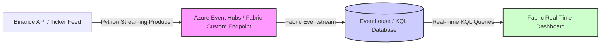

# 🪙 Real-Time Cryptocurrency Analytics Platform

<p align="center">
  
  
  
  
</p>

[](https://azure.microsoft.com/en-us/products/microsoft-fabric/)
[](https://docs.microsoft.com/en-us/azure/data-explorer/kusto/query/)
[](https://www.python.org/)
[](https://binance-docs.github.io/apidocs/spot/en/)

An end-to-end streaming analytics platform built on **Microsoft Fabric Real-Time Intelligence (RTI)** for continuous, low-latency cryptocurrency market monitoring. This accelerator captures live ticker prices, streams them through Fabric Eventstreams into Eventhouse databases, runs real-time analytical KQL queries, and surfaces live KPIs on a Fabric Real-Time Dashboard.

Designed and developed by **Arghyadeep Paul** (*Associate Technical Consultant – Data Analytics & AI*), certified Fabric Analytics Engineer Associate and Power BI Data Analyst Associate.

---

> [!IMPORTANT]
> 🛠️ **Status: Active Creation Stage (Open for Collaboration!)**
>
> This solution accelerator is currently in an open-source **creation/templating stage**. While the central Real-Time Dashboard and Eventstream definitions are fully configured, the companion ingestion modules are active templates. We need help expanding features! Check out the [Contributing](#-contributing--open-source-help-needed) section below.

---

## 🏗️ 1. Architecture Flow

The data streaming pipeline is structured as follows:



*   **Ingestion Feed**: A Python script runs in the background, polling ticker data from the Binance API and pushing it to a streaming destination.
*   **Orchestration & Routing**: Fabric Eventstream acts as the ingestion broker, routing streaming events with zero-code transformation directly into table structures.
*   **Storage & Querying**: Fabric Eventhouse (KQL Database) hosts the columns in a highly indexed, compressed column store designed for high-throughput temporal data.
*   **Presentation**: Fabric Real-Time Dashboard refreshes automatically to surface price trends, standard deviations (market volatility), and rolling trading volumes.

---

## 🐍 2. Python Streaming Producer Code

To stream real-time price feeds into your Azure Event Hub or Fabric Eventstream Custom Endpoint, use this Python producer script template.

### Installation

First, install the required libraries:
```bash
pip install requests azure-eventhub
```

### Python Script (`producer.py`)

Save the following code as `producer.py` and configure the connection string:

```python
import json
import time
import requests
from azure.eventhub import EventHubProducerClient, EventData

# --- CONFIGURATION ---
# Replace with your Fabric Eventstream Event Hub Connection String
CONNECTION_STR = "Endpoint=sb://<your-namespace>.servicebus.windows.net/;SharedAccessKeyName=<key-name>;SharedAccessKey=<key>"
EVENTHUB_NAME = "crypto-stream"
SYMBOL = "BTCUSDT"  # Target trading pair

def get_binance_ticker(symbol):
    """
    Fetches the current price and volume metrics from the Binance Spot API.
    """
    url = f"https://api.binance.com/api/v3/ticker/price?symbol={symbol}"
    try:
        response = requests.get(url, timeout=5)
        response.raise_for_status()
        data = response.json()
        return {
            "symbol": data["symbol"],
            "price": float(data["price"]),
            "timestamp": int(time.time() * 1000) # Epoch milliseconds
        }
    except Exception as e:
        print(f"Error fetching data from Binance: {e}")
        return None

def stream_ticker_feed():
    """
    Streams live ticker metrics to Azure Event Hub / Fabric Eventstream.
    """
    print(f"Connecting to Event Hub: {EVENTHUB_NAME}...")
    producer = EventHubProducerClient.from_connection_string(
        conn_str=CONNECTION_STR, 
        eventhub_name=EVENTHUB_NAME
    )
    print(f"Streaming started for {SYMBOL}. Press Ctrl+C to exit.")
    
    try:
        while True:
            ticker = get_binance_ticker(SYMBOL)
            if ticker:
                # Package and send payload batch
                batch = producer.create_batch()
                batch.add(EventData(json.dumps(ticker)))
                producer.send_batch(batch)
                print(f"Successfully Sent event: {ticker}")
            time.sleep(2)  # Ingest ticker data every 2 seconds
            
    except KeyboardInterrupt:
        print("\nStopping streaming feed...")
    finally:
        producer.close()
        print("Event Hub Producer closed.")

if __name__ == "__main__":
    stream_ticker_feed()
```

---

## 🔍 3. Real-Time KQL Queries

KQL (Kusto Query Language) is used to perform low-latency aggregation inside the KQL Database. Below are the key queries used to build the real-time analytics dashboard:

### 1. Rolling Average Price Trend (1-Minute Intervals)
Groups live ticker feeds into 1-minute time windows to visualize price movement trends:
```kql
crypto_events
| where timestamp > ago(2h)
| summarize AvgPrice = avg(price) by bin(timestamp, 1m), symbol
| order by timestamp asc
| render timechart
```

### 2. Market Volatility Index (Rolling Standard Deviation)
Computes the standard deviation of price changes and the relative spread to detect market volatility over rolling 5-minute intervals:
```kql
crypto_events
| where timestamp > ago(12h)
| summarize 
    AvgPrice = avg(price), 
    MinPrice = min(price), 
    MaxPrice = max(price), 
    PriceStdDev = stdev(price) 
    by bin(timestamp, 5m), symbol
| extend VolatilityIndex = round((PriceStdDev / AvgPrice) * 100, 4)
| project timestamp, symbol, VolatilityIndex, MaxPrice, MinPrice, AvgPrice
```

### 3. Total Transaction/Tick Volume (Hourly Bins)
Tracks the frequency of ingestion ticks per hour to monitor system throughput and API activity:
```kql
crypto_events
| where timestamp > ago(24h)
| summarize IngestedTicks = count() by bin(timestamp, 1h), symbol
| render columnchart
```

---

## 🛠️ 4. How to Deploy the Platform

Follow these steps to configure the real-time platform in your Microsoft Fabric environment:

### Step 1: Create an Eventhouse
1. Open your workspace, click **Workspaces** $\rightarrow$ select your capacity workspace.
2. In the experiences selector, choose **Real-Time Intelligence**.
3. Click **Eventhouse**, name it `Crypto_Analytics_EH`, and click **Create**. This automatically creates an associated KQL Database.

### Step 2: Set Up the KQL Table
1. Open your KQL database under the Eventhouse.
2. Create a new table named `crypto_events` by running the following KQL command in the query pane:
   ```kql
   .create table crypto_events (
       symbol: string,
       price: real,
       timestamp: datetime
   )
   ```

### Step 3: Configure Eventstream
1. On the workspace home page, click **Eventstream** $\rightarrow$ name it `Crypto_Stream`.
2. Click **New source** $\rightarrow$ **Custom App**.
   * Note the connection details, Shared Access Key, and connection string parameters.
3. Click **New destination** $\rightarrow$ **KQL Database**.
   * Select your workspace, Eventhouse, KQL Database, and the `crypto_events` table.
   * Map the JSON schema keys directly to the table columns.

### Step 4: Run the Streaming Producer
1. Open a terminal on your computer.
2. Run the `producer.py` Python script (configured with the Eventstream connection parameters from Step 3).
3. Confirm that the data is successfully sent to Fabric.

### Step 5: Import the Dashboard
1. On the workspace home page, click **Real-Time Dashboard** $\rightarrow$ select **New Real-Time Dashboard**.
   * Name: `Crypto Live Monitor`.
2. Click the ellipsis `...` in the top right of the dashboard screen and select **Replace with JSON** / **Import from File**.
3. Upload the file: `dashboard-Crypto Dashboard.json`.
4. Connect the dashboard to your KQL Database. The dashboard will instantly load and begin displaying live charts.

---

## 🤝 5. Contributing & Open-Source Help Needed!

This accelerator is open-source and **currently in development**. We invite contributions from the developer community to help bring this solution to full production capabilities!

### 💡 Up-For-Grabs Features:
*   [ ] **Multicast Streams**: Extend `producer.py` to stream multiple cryptocurrency pairs simultaneously (e.g. ETH, SOL, ADA).
*   [ ] **API Integrations**: Add connectors for other exchange APIs (Coinbase WebSocket, Kraken REST).
*   [ ] **Containerization**: Create a Dockerfile to run `producer.py` as a serverless container on ECS or ACI.
*   [ ] **KQL Alerting Library**: Design a database query alert script that triggers a Fabric Reflex event when standard deviation exceeds a user-defined threshold (volatility alerts).

**How to contribute**:
1. Fork the repo and clone locally.
2. Code your feature, add test results, and update the directory index.
3. Open a Pull Request detailing your solution!

---

## 📂 6. Project Directory Structure

```
├── Crypto Realtime/
│   ├── producer.py                       # Standalone Python streaming producer template
│   ├── dashboard-Crypto Dashboard.json   # Exported Fabric Real-Time Dashboard definition
│   ├── Screenshot 2026-07-01 172731.png  # Dashboard Preview: Main Ticker Trends
│   ├── Screenshot 2026-07-01 172812.png  # Dashboard Preview: Volatility calculations
│   ├── Screenshot 2026-07-01 172829.png  # Dashboard Preview: Event ingestion rates
│   ├── Screenshot 2026-07-01 172900.png  # Dashboard UI layout configuration
│   ├── Screenshot 2026-07-01 172911.png  # Eventstream routing preview
│   ├── .gitignore                        # Git exclusion configuration
│   └── LICENSE                           # MIT License
```

---

## 📄 7. License

This project is licensed under the MIT License - see the [LICENSE](LICENSE) file for details.
