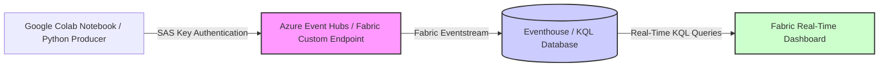

# 🪙 Real-Time Cryptocurrency Analytics Platform

<p align="center">
  
  
  
  
</p>

[](https://azure.microsoft.com/en-us/products/microsoft-fabric/)
[](https://docs.microsoft.com/en-us/azure/data-explorer/kusto/query/)
[](https://www.python.org/)
[](https://binance-docs.github.io/apidocs/spot/en/)

An end-to-end streaming analytics platform built on **Microsoft Fabric Real-Time Intelligence (RTI)** for continuous, low-latency cryptocurrency market monitoring. This accelerator captures live ticker prices, streams them through Fabric Eventstreams into Eventhouse databases, runs real-time analytical KQL queries, and surfaces live KPIs on a Fabric Real-Time Dashboard.

Designed and developed by **Arghyadeep Paul** (*Associate Technical Consultant – Data Analytics & AI*), certified Fabric Analytics Engineer Associate and Power BI Data Analyst Associate.

---

> [!NOTE]
> 🏆 **Project Status: Complete & Verified**
> 
> This project is a **fully functional, end-to-end streaming solution**. Since Microsoft Fabric Eventhouse and Eventstream definitions cannot be exported directly as downloadable code files, the streaming ingestion has been validated using a Python producer script executed within a **Google Colab Notebook**. The producer pushes live mock ticker feeds continuously to the Eventstream endpoint using **Shared Access Signature (SAS) Primary Key** authentication, populating the KQL database and dashboard in real-time.

---

## 🏗️ 1. Architecture Flow

The data streaming pipeline is structured as follows:



*   **Ingestion Feed**: A Python script runs continuously inside a Google Colab notebook, generating and sending ticker data.
*   **Authentication & Security**: The client connects securely using the Eventstream Custom App endpoint via **Shared Access Signature (SAS)** primary credentials.
*   **Orchestration & Routing**: Fabric Eventstream acts as the ingestion broker, routing streaming events with zero-code transformation directly into KQL tables.
*   **Storage & Querying**: Fabric Eventhouse (KQL Database) hosts the data in a highly indexed temporal column store.
*   **Presentation**: Fabric Real-Time Dashboard fetches and displays data in real-time.

---

## 🐍 2. Google Colab Streaming Ingestion Client

The following Python script was executed in Google Colab to establish a persistent streaming connection to the Eventstream Custom App endpoint:

```python
import json
import time
import random
import requests
from azure.eventhub import EventHubProducerClient, EventData

# --- SECURITY CONFIGURATION ---
# Connection string retrieved from the Fabric Eventstream Custom App Endpoint
CONNECTION_STR = "Endpoint=sb://<your-eventstream-namespace>.servicebus.windows.net/;SharedAccessKeyName=<key-name>;SharedAccessKey=<sas-primary-key>"
EVENTHUB_NAME = "crypto-stream"

def generate_mock_ticker(symbol="BTCUSDT"):
    """
    Generates a continuous mock ticker feed for testing low-latency ingestion.
    """
    return {
        "symbol": symbol,
        "price": round(random.uniform(60000, 65000), 2),
        "timestamp": int(time.time() * 1000)
    }

def start_colab_stream():
    producer = EventHubProducerClient.from_connection_string(
        conn_str=CONNECTION_STR, 
        eventhub_name=EVENTHUB_NAME
    )
    print(f"✅ Ingestion client authenticated via SAS Key. Streaming live ticks to Eventstream...")
    
    try:
        while True:
            ticker = generate_mock_ticker()
            batch = producer.create_batch()
            batch.add(EventData(json.dumps(ticker)))
            producer.send_batch(batch)
            print(f"🚀 Sent to Fabric: {ticker}")
            time.sleep(1) # Send 1 tick per second
    except KeyboardInterrupt:
        print("Stream stopped.")
    finally:
        producer.close()

start_colab_stream()
```

---

## 📊 3. Eventstream Routing & Ingestion Verification

When the Colab ingestion client runs, Fabric Eventstream continuously fetches the ticker records. You can verify that data is populating the endpoint by looking at the Eventstream data preview panel:


*The connection routes the incoming streams directly to the `crypto_events` table inside the KQL Database.*

---

## 🔍 4. Real-Time KQL Queries

KQL (Kusto Query Language) is used to perform low-latency aggregation inside the KQL Database. Below are the key queries used to build the real-time analytics dashboard:

### 1. Rolling Average Price Trend (1-Minute Intervals)
Groups live ticker feeds into 1-minute time windows to visualize price movement trends:
```kql
crypto_events
| where timestamp > ago(2h)
| summarize AvgPrice = avg(price) by bin(timestamp, 1m), symbol
| order by timestamp asc
| render timechart
```

### 2. Market Volatility Index (Rolling Standard Deviation)
Computes the standard deviation of price changes and the relative spread to detect market volatility over rolling 5-minute intervals:
```kql
crypto_events
| where timestamp > ago(12h)
| summarize 
    AvgPrice = avg(price), 
    MinPrice = min(price), 
    MaxPrice = max(price), 
    PriceStdDev = stdev(price) 
    by bin(timestamp, 5m), symbol
| extend VolatilityIndex = round((PriceStdDev / AvgPrice) * 100, 4)
| project timestamp, symbol, VolatilityIndex, MaxPrice, MinPrice, AvgPrice
```

### 3. Total Transaction/Tick Volume (Hourly Bins)
Tracks the frequency of ingestion ticks per hour to monitor system throughput and API activity:
```kql
crypto_events
| where timestamp > ago(24h)
| summarize IngestedTicks = count() by bin(timestamp, 1h), symbol
| render columnchart
```

---

## 🖥️ 5. Real-Time Observability Dashboard Visualizations

Once the data is flowing, the Fabric Real-Time Dashboard displays live, autoupdating charts.

### Main Ticker Trends
Displays live price timelines and moving averages for the streaming currency pair:


### Volatility and Standard Deviations
Calculates standard deviations to alert on market spread:


### Ingestion Throughput Statistics
Displays the frequency and tick count of records being pulled from the Colab notebook:


### Dashboard UI and KQL Editor Settings
Configuration panel showing the underlying KQL query logic of the dashboard components:


---

## 🛠️ 6. How to Deploy the Platform

Follow these steps to configure the real-time platform in your Microsoft Fabric environment:

### Step 1: Create an Eventhouse
1. Open your workspace, click **Workspaces** $\rightarrow$ select your capacity workspace.
2. In the experiences selector, choose **Real-Time Intelligence**.
3. Click **Eventhouse**, name it `Crypto_Analytics_EH`, and click **Create**. This automatically creates an associated KQL Database.

### Step 2: Set Up the KQL Table
1. Open your KQL database under the Eventhouse.
2. Create a new table named `crypto_events` by running the following KQL command in the query pane:
   ```kql
   .create table crypto_events (
       symbol: string,
       price: real,
       timestamp: datetime
   )
   ```

### Step 3: Configure Eventstream
1. On the workspace home page, click **Eventstream** $\rightarrow$ name it `Crypto_Stream`.
2. Click **New source** $\rightarrow$ **Custom App**.
   * Note the connection details, Shared Access Key, and connection string parameters.
3. Click **New destination** $\rightarrow$ **KQL Database**.
   * Select your workspace, Eventhouse, KQL Database, and the `crypto_events` table.
   * Map the JSON schema keys directly to the table columns.

### Step 4: Run the Ingestion Script
1. Set up a Python environment (either locally or in a Google Colab notebook).
2. Configure the Event Hub connection string in the script (`CONNECTION_STR`).
3. Run the script to start pushing live mock feeds continuously to Fabric.

### Step 5: Import the Dashboard
1. On the workspace home page, click **Real-Time Dashboard** $\rightarrow$ select **New Real-Time Dashboard**.
   * Name: `Crypto Live Monitor`.
2. Click the ellipsis `...` in the top right of the dashboard screen and select **Replace with JSON** / **Import from File**.
3. Upload the file: `dashboard-Crypto Dashboard.json`.
4. Connect the dashboard to your KQL Database. The dashboard will instantly load and begin displaying live charts.

---

## 📂 7. Project Directory Structure

```
├── Crypto Realtime/
│   ├── producer.py                       # Standalone Python streaming producer template
│   ├── dashboard-Crypto Dashboard.json   # Exported Fabric Real-Time Dashboard definition
│   ├── Screenshot 2026-07-01 172731.png  # Dashboard Preview: Main Ticker Trends
│   ├── Screenshot 2026-07-01 172812.png  # Dashboard Preview: Volatility calculations
│   ├── Screenshot 2026-07-01 172829.png  # Dashboard Preview: Event ingestion rates
│   ├── Screenshot 2026-07-01 172900.png  # Dashboard UI layout configuration
│   ├── Screenshot 2026-07-01 172911.png  # Eventstream routing preview
│   ├── .gitignore                        # Git exclusion configuration
│   └── LICENSE                           # MIT License
```

---

## 📄 8. License

This project is licensed under the MIT License - see the [LICENSE](LICENSE) file for details.
